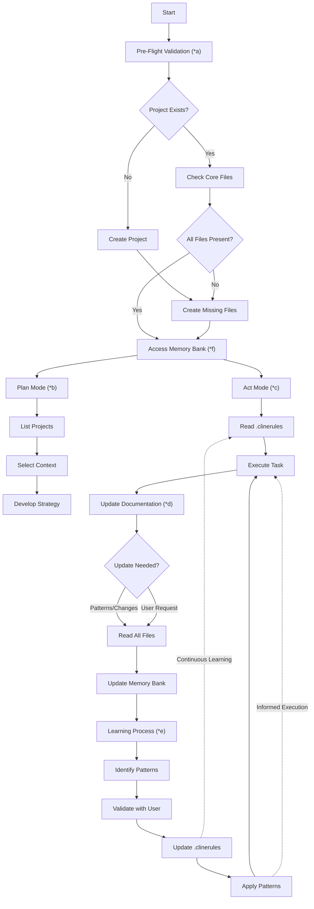
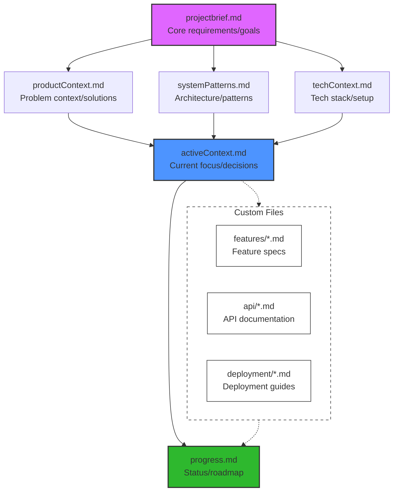

# Memory Bank MCP Server

A Model Context Protocol (MCP) server implementation for remote memory bank management, inspired by [Cline Memory Bank](https://github.com/nickbaumann98/cline_docs/blob/main/prompting/custom%20instructions%20library/cline-memory-bank.md).

## Overview

The Memory Bank MCP Server transforms traditional file-based memory banks into a centralized service that:

- Provides remote access to memory bank files via MCP protocol
- Enables multi-project memory bank management
- Maintains consistent file structure and validation
- Ensures proper isolation between project memory banks

## Features

- **Multi-Project Support**

  - Project-specific directories
  - File structure enforcement
  - Path traversal prevention
  - Project listing capabilities
  - File listing per project

- **Remote Accessibility**

  - Full MCP protocol implementation
  - Type-safe operations
  - Proper error handling
  - Security through project isolation

- **Core Operations**
  - Read/write/update memory bank files
  - List available projects
  - List files within projects
  - Project existence validation
  - Safe read-only operations

## Installation

```bash
# Install globally
npm install -g memory-bank-mcp
# or
pnpm add -g memory-bank-mcp

# Or install locally in your project
npm install memory-bank-mcp
# or
pnpm add memory-bank-mcp
```

## Quick Start

1. Initialize a new project's memory bank:

```bash
init-memory-bank my-project [optional-root-dir]
```

This will create a new project directory with all required memory bank files.

2. Configure the MCP server in your settings (see Configuration section below).

3. Start using the memory bank tools in your AI assistant.

## Configuration

The memory bank MCP server needs to be configured in your Cline MCP settings file. The location depends on your setup:

- For Cline extension: `~/Library/Application Support/Cursor/User/globalStorage/saoudrizwan.claude-dev/settings/cline_mcp_settings.json`
- For Claude desktop app: `~/Library/Application Support/Claude/claude_desktop_config.json`

To connect the Memory Bank MCP server to your project, add the following configuration to your MCP settings:

```json
{
  "memory-bank": {
    "command": "node",
    "args": ["<path-to-dist>/index.js"],
    "env": {
      "MEMORY_BANK_ROOT": "<path-to-memory-bank-root>"
    },
    "disabled": false,
    "autoApprove": [
      "memory_bank_read",
      "memory_bank_write",
      "memory_bank_update",
      "list_projects",
      "list_project_files"
    ]
  }
}
```

### Configuration Details

- `<path-to-dist>/index.js`: Path to the built server entry point (e.g., `/path/to/memory-bank-mcp/dist/index.js`)
- `<path-to-memory-bank-root>`: Directory where project memory banks will be stored (e.g., `/path/to/memory-bank`)
- `disabled`: Set to `false` to enable the server
- `autoApprove`: List of operations that don't require explicit user approval
  - `memory_bank_read`: Read memory bank files
  - `memory_bank_write`: Create new memory bank files
  - `memory_bank_update`: Update existing memory bank files
  - `list_projects`: List available projects
  - `list_project_files`: List files within a project

## Custom IA instructions

This section contains the instructions that should be pasted on the AI custom instructions, either for Cline, Claude or Cursor. You should copy and paste these rules. For reference, see [custom-instructions.md](custom-instructions.md) which contains these rules.

# Memory Bank via MCP

I'm an expert engineer whose memory resets between sessions. I rely ENTIRELY on my Memory Bank, accessed via MCP tools, and MUST read ALL memory bank files before EVERY task.

## Key Commands

1. "follow your custom instructions"

   - Triggers Pre-Flight Validation (\*a)
   - Follows Memory Bank Access Pattern (\*f)
   - Executes appropriate Mode flow (Plan/Act)

2. "initialize memory bank"

   - Follows Pre-Flight Validation (\*a)
   - Creates new project if needed
   - Establishes core files structure (\*f)

3. "update memory bank"
   - Triggers Documentation Updates (\*d)
   - Performs full file re-read
   - Updates based on current state

## Memory Bank lyfe cycle:



## Phase Index & Requirements

a) **Pre-Flight Validation**

- **Triggers:** Automatic before any operation
- **Checks:**
  - Project directory existence
  - Core files presence (projectbrief.md, productContext.md, etc.)
  - Custom documentation inventory

b) **Plan Mode**

- **Inputs:** Filesystem/list_directory results
- **Outputs:** Strategy documented in activeContext.md
- **Format Rules:** Validate paths with forward slashes

c) **Act Mode**

- **JSON Operations:**
  ```json
  {
    "projectName": "project-id",
    "fileName": "progress.md",
    "content": "Escaped\\ncontent"
  }
  ```
- **Requirements:**
  - Use \\n for newlines
  - Pure JSON (no XML)
  - Boolean values lowercase (true/false)

d) **Documentation Updates**

- **Triggers:**
  - ≥25% code impact changes
  - New pattern discovery
  - User request "update memory bank"
  - Context ambiguity detected
- **Process:** Full file re-read before update

e) **Project Intelligence**

- **.clinerules Requirements:**
  - Capture critical implementation paths
  - Document user workflow preferences
  - Track tool usage patterns
  - Record project-specific decisions
- **Cycle:** Continuous validate → update → apply

f) **Memory Bank Structure**



- **File Relationships:**
  - projectbrief.md feeds into all context files
  - All context files inform activeContext.md
  - progress.md tracks implementation based on active context
- **Color Coding:**
  - Purple: Foundation documents
  - Blue: Active work documents
  - Green: Status tracking
  - Dashed: Custom documentation (flexible/optional)
- **Access Pattern:**

  - Always read in hierarchical order
  - Update in reverse order (progress → active → others)
  - .clinerules accessed throughout process
  - Custom files integrated based on project needs

- **Custom Files:**
  - Can be added when specific documentation needs arise
  - Common examples:
    - Feature specifications
    - API documentation
    - Integration guides
    - Testing strategies
    - Deployment procedures
  - Should follow main structure's naming patterns
  - Must be referenced in activeContext.md when added

## Development

```bash
# Install dependencies
npm install

# Build
npm run build

# Test
npm run test

# Watch mode
npm run dev
```

## Contributing

Contributions are welcome! Please follow these steps:

1. Fork the repository
2. Create a feature branch (`git checkout -b feature/amazing-feature`)
3. Commit your changes (`git commit -m 'Add amazing feature'`)
4. Push to the branch (`git push origin feature/amazing-feature`)
5. Open a Pull Request

### Development Guidelines

- Use TypeScript for all new code
- Maintain type safety across the codebase
- Add tests for new features
- Update documentation as needed
- Follow existing code style and patterns

### Testing

- Write unit tests for new features
- Include multi-project scenario tests
- Test error cases thoroughly
- Validate type constraints
- Mock filesystem operations appropriately

## License

This project is licensed under the MIT License - see the [LICENSE](LICENSE) file for details.

## Acknowledgments

This project implements the memory bank concept originally documented in the [Cline Memory Bank](https://github.com/nickbaumann98/cline_docs/blob/main/prompting/custom%20instructions%20library/cline-memory-bank.md), extending it with remote capabilities and multi-project support.
